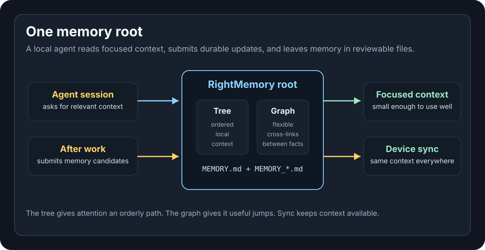
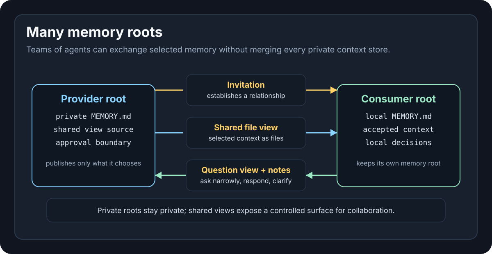
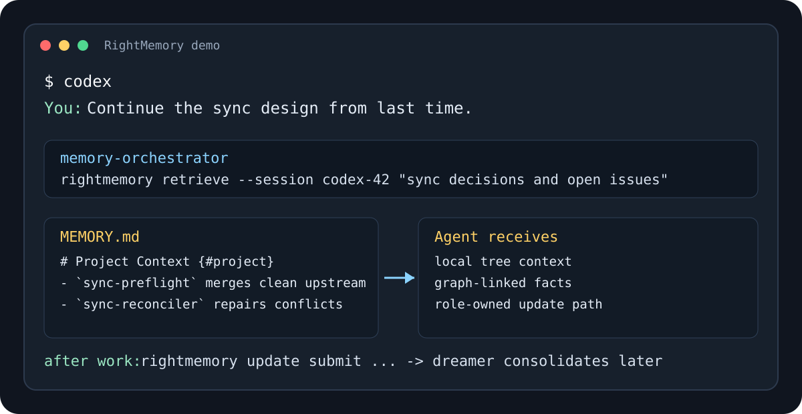

# RightMemory

**Tree + graph memory for teams of AI coding agents.**

RightMemory gives people and coding agents a structured memory substrate: a heading tree for orderly local context, graph edges for flexible relationships, and shared views for controlled collaboration between memory roots. Memory stays in ordinary Git-syncable files, so durable context can move across sessions, devices, users, agent clients, and collaborating agent teams instead of living inside one vendor UI.





## Why RightMemory

Modern coding agents are strong inside a single conversation, then strangely forgetful in the next one. RightMemory treats memory as owned project and collaboration state:

- **Multi-agent collaboration:** memory roots can share selected context, answer constrained questions, and exchange notes without exposing the whole private memory store.
- **Tree + graph structure:** headings give agents local reading context, while node ids and typed edges connect related facts across sessions and files.
- **Readable files:** memory lives in `MEMORY.md`, optional `MEMORY_<slug>.md` detail files, and `insight_logs/` reflection artifacts, so it can be inspected, diffed, versioned, and shared through a normal Git remote.
- **Clear ownership:** retrieval, updates, transcript review, sync repair, consolidation, and reflection run through role-specific commands instead of letting the main agent half-edit memory while doing unrelated work.
- **Vendor-neutral command surface:** Codex CLI and Claude Code CLI have built-in delegated execution today; Gemini CLI-style workflows and other command-capable agents can use the same `rightmemory` CLI or JSON-over-stdio daemon surface.

## Who It Is For

RightMemory is aimed at developers who spend serious time with coding agents and want durable context that survives new sessions, new devices, and agent-client changes. It is especially useful when your agents need to remember project decisions, user context, workflow expectations, cross-session behavior guidance, or review notes from supported agent sessions.

## Quick Start

Install prerequisites:

```bash
# macOS
brew install uv git
# or install git with Apple's tools:
xcode-select --install

# Ubuntu / Debian / WSL
curl -LsSf https://astral.sh/uv/install.sh | sh
sudo apt update && sudo apt install -y git

# Linux Fedora
curl -LsSf https://astral.sh/uv/install.sh | sh
sudo dnf install git
```

More options: [uv install](https://docs.astral.sh/uv/getting-started/installation/),
[git install](https://git-scm.com/book/en/v2/Getting-Started-Installing-Git).

```bash
git clone https://github.com/RightL/RightMemory.git
cd RightMemory
./install.sh
```

The default install uses standalone mode, creates `~/.rightmemory`, installs the `rightmemory` CLI, and installs the command-backed orchestrator skill into both `~/.codex/skills` and `~/.claude/skills`. Any agent that can run shell commands, including Gemini CLI-style workflows, can call the CLI directly; the packaged skill install currently targets Codex and Claude Code.

If you already use Codex CLI or Claude Code CLI and want RightMemory roles to run through those tools:

```bash
./install.sh --mode cli-agent ~/.rightmemory ~/.codex/skills
rightmemory doctor agent-cli
```

After install, add a short instruction to your agent guidance file, such as
`AGENTS.md` for Codex or `CLAUDE.md` for Claude Code:

```markdown
Use the memory-orchestrator skill to retrieve and update memory.
```

Then start the background watcher. It reviews recent agent sessions, checks
prune generations, runs Dreamer consolidation, and produces Insight reflections
when enough memory work has accumulated:

```bash
rightmemory watch start
```

## Demo Flow



A typical RightMemory turn looks like this:

```text
You ask a coding agent:
  "Continue the sync work from last time."

memory-orchestrator calls:
  rightmemory retrieve --session <id> "project sync decisions and open issues"

RightMemory returns:
  relevant Markdown headings, node ids, and graph-linked facts

After the task:
  rightmemory update submit --session <id> "what changed and what should persist"

Later:
  rightmemory dreamer consolidates stale, duplicated, or overgrown memory
  rightmemory insight writes durable reflection artifacts when useful
```

For a short recording script, see [docs/DEMO.md](docs/DEMO.md).

## What It Gives You

- A heading tree of `#`, `##`, and `###` sections for hierarchical retrieval context.
- Addressable heading anchors and node ids for precise agent references.
- Typed graph edges such as `dep:`, `cfg:`, `ver:`, `doc:`, and `todo:` for traversal across the tree.
- Ordinary Git-syncable files: `MEMORY.md`, optional sibling detail files named `MEMORY_<slug>.md`, and `insight_logs/`.
- A command-backed `memory-orchestrator` skill for retrieval, updates, change-triggered consolidation, and reflection.
- Two executor modes behind the same `rightmemory` CLI: standalone runtime or delegated Codex/Claude CLI role execution.
- Optional automatic transcript review for idle Codex and Claude sessions.

## Install Options And Updates

For a custom memory root or skill target:

```bash
./install.sh ~/.rightmemory ~/.codex/skills
```

CLI-agent mode delegates role execution to Codex CLI or Claude Code CLI while preserving the same `rightmemory` command surface:

```bash
./install.sh --mode cli-agent ~/.rightmemory ~/.codex/skills
```

Fresh installs baseline the current semantic upgrade notes because the seeded memory already matches the current schema. Re-run the installer after pulling updates; existing real memory is preserved, the managed example block refreshes when present, and pending semantic upgrade notes are reported for the next dreamer cycle. Semantic upgrade notes are maintainer-authored prompts for dreamer to revisit older memory under the current schema and role model; install does not run dreamer or edit user memory to apply them.

### Profiles

The default memory root is still `~/.rightmemory`, or `RIGHTMEMORY_ROOT` when set.
Named profiles let a project use a separate memory root:

```bash
rightmemory profile create my-project
rightmemory --profile my-project retrieve --session <agent-session-id> "what do we know about this repo?"
```

Profile aliases live in `<default-memory-root>/profiles.toml`. New profile roots
default to a sibling profile-root area, such as
`~/.rightmemory-profiles/my-project` for the normal default root. Each profile
root has its own `MEMORY.md`, `rightmemory.toml`, `.runtime/`, Git history,
watcher state, async update queues, sessions, and insight logs.

A project can opt into a local default profile by adding `.rightmemory-profile`
with the profile name:

```text
my-project
```

Tracking or ignoring that file is a user/project decision. Use `--profile` when
you want an explicit override for one command.

## Why Not Raw Notes Or A Vector DB?

RightMemory is not trying to replace notes, search, or embeddings. It focuses on the part those systems often leave underspecified: how agents preserve structured context, who owns memory edits, how related facts stay connected across sessions, and how durable memory remains reviewable over time.

| Approach | Works Well For | RightMemory Adds |
| --- | --- | --- |
| Raw Markdown notes | Human-readable context | Agent-addressable trees, graph edges, and role-owned updates |
| Vector retrieval | Fuzzy recall across large text | Inspectable structure, deterministic files, and explicit consolidation |
| Agent chat history | Recent session continuity | Durable project memory that survives new sessions, devices, and agent clients |
| MCP memory adapters | Tool integration | A file schema and command runtime that can be wrapped by adapters later |

## Memory Model

Each memory file is ordinary Markdown with a small schema.

```md
# Work Context {#work-context}

## Project Alpha {#project-alpha}

### Runtime {F#alpha-runtime} → [cfg:alpha-config]

Runtime facts that apply to the whole project.

- `alpha-python-env` Uses Python 3.11 in `.venv` for local development. → [cfg:alpha-runtime]
- `alpha-test-command` Run the backend tests with `pytest tests/backend`. → [ver:alpha-python-env]
```

The tree tells agents where to read in local context. Anchors and node ids tell agents what can be referenced. Edges tell agents where to walk across otherwise separate branches.

Common top-level domains include project or work domains, `# User Context`, and `# Cross-Session Agent Behavior`. User context stores the user's durable context profile. Agent behavior stores guidance about how coding agents should collaborate with that user.

### Headings

`#`, `##`, and `###` are normal tree layers and may contain memory content. They can have `{#slug}` anchors and heading-level edges when the whole subtree is useful as a graph target.

Addressable `#`, `##`, and `###` headings may also have body paragraphs directly under the heading. Those paragraphs describe the heading itself. Use a heading body when the text explains the whole concept; use child nodes when the fact should stand on its own.

Use `{F#slug}` instead of `{#slug}` when a heading is backed by a sibling detail file. The file is `MEMORY_<slug>.md`; graph edges still target `slug`, not `F#slug`.

`####` is the deepest heading level allowed in a memory file. A `#### Topic {F#slug}` heading points to `MEMORY_<slug>.md`; it may have body paragraphs that summarize or explain the detail file, but do not put nodes or child headings underneath it in the current file.

### Nodes

Nodes are durable facts under a heading:

```md
- `<node-id>` <description> → [edge1, edge2, ...]
```

Heading ids and node ids share one namespace. A node with no edges still writes `→ []`; a heading with no edges may omit the edge list.

### Detail Files

Any `#`, `##`, or `###` heading can use its slug as a detail-file target by writing `{F#slug}`. For example, `{F#alpha-runtime}` maps to `MEMORY_alpha-runtime.md`.

Move child content into a detail file when a heading becomes too dense, especially past about 15 direct node lines. Count only direct node lines, not child headings or `####` pointers. After moving content out, keep only the `F#` heading line and any heading body paragraphs in the parent file.

### Shared Views

Shared views connect one memory root to collaboration context owned somewhere else: another person, team space, project, or agent memory root. RightMemory now uses two explicit heading types:

- `{MF#slug}` records a mirrored file shared view. Retrieve silently pulls the latest HTTP package into `.runtime/shared_views/imports/<slug>/` before the retrieve agent starts, then the retrieve agent uses ordinary read/search tools on that local mirror.
- `{MQ#slug}` records a provider question shared view. Retrieve may report that provider-question context is relevant, but the main agent, CLI, or Web Studio calls the question endpoint explicitly with `rightmemory shared-view ask`.

For a practical provider/consumer walkthrough, see [docs/shared-views-usage.md](docs/shared-views-usage.md).

`rightmemory share` is the normal relationship-level workflow. A share groups one optional file part and one optional question part under one relationship and one bundled invitation. The lower-level `rightmemory shared-view` commands remain available for advanced use and debugging.

The provider owns source files under `shared_views/<view-id>/`. File views use `view.md` and `recipe.toml`, then render generated `dist/` packages for HTTP publication. Question views use `view.md`, `question.toml`, and provider-private `retriever.md`. Share relationships live in `shares.toml`; consumers record low-level resolver metadata in `shared_views.toml`; credentials, imports, and interaction records stay under `.runtime/shared_views/`.

```bash
rightmemory share create auth-api \
  --provider alice \
  --hub-url http://127.0.0.1:8765 \
  --credential-id alice-publish \
  --request "Share auth API context with the frontend project and allow live questions." \
  --capability both \
  --question-base-url http://127.0.0.1:8766

rightmemory share revise auth-api "Narrow the share to login refresh-token behavior."
rightmemory share approve auth-api
rightmemory share publish auth-api --label frontend
rightmemory share join http://127.0.0.1:8765/i/share/<invite-token> --consumer-label frontend
rightmemory share status auth-api
rightmemory shared-view ask auth-api-ask "How do tokens refresh?"
rightmemory shared-view note auth-api-files --confirm --task "frontend login migration" \
  "Docs are missing token_expires_at."
rightmemory shared-view inbox
```

All normal sharing goes through HTTP, even on one machine. Initialize and serve a separate hub root, create a provider token, and store that token as a local runtime credential in the provider memory root:

```bash
rightmemory hub init --public-base-url http://127.0.0.1:8765
rightmemory hub token create --provider alice --label publish
rightmemory hub serve --host 127.0.0.1 --port 8765
```

After the hub is running, open `http://127.0.0.1:8765/console` and enter the admin token printed by `rightmemory hub init`. The console is for hub administration: providers, tokens, views, invitations, connections, inbox, and audit.

Then store the printed provider token through a hidden prompt, so it does not need to appear in shell history:

```bash
rightmemory shared-view credential set alice-publish \
  --kind http-publish \
  --hub-url http://127.0.0.1:8765 \
  --provider alice \
  --token-prompt
```

Approved `MF#` file views rebuild and publish automatically after successful memory-write roles. `rightmemory retrieve` silently syncs accepted `MF#` packages before it searches, without adding sync output to retrieve session history.

Create an `MF#` invitation by publishing the current file package and asking the hub for an invitation URL:

```bash
rightmemory shared-view invite auth-api-files --label frontend
```

Approved `MQ#` question views are published explicitly:

```bash
rightmemory shared-view publish-question auth-api-ask \
  --hub-url http://127.0.0.1:8765 \
  --credential-id alice-publish \
  --question-base-url http://127.0.0.1:8765
```

Consumers accept HTTP invitations with `accept-invite`:

```bash
rightmemory shared-view accept-invite http://127.0.0.1:8765/i/<invite-token>
```

For `MF#`, the synced `shared_views.toml` stores the hub URL and credential id. For `MQ#`, the invitation must provide the provider Web Studio question endpoint and an accepted `question_token`; the ask command sends that bearer token, and the provider validates it against `question.toml` token hashes. Bearer tokens stay under `.runtime/shared_views/credentials.toml`.

Web Studio starts with the same share-first provider flow: create and revise a share from natural language, inspect share relationships, and keep the raw `MF#`/`MQ#` builder tools in an advanced section. Direct provider filesystem reads, mounted folder hubs, generic shared-view retrieval, and legacy single-marker shared-view headings are not part of the current product path.

### Edges

Use the most specific edge type that fits:

- `dep:` A depends on B.
- `emb:` A embeds a copy of B.
- `bak:` A is a backup or snapshot of B.
- `agg:` A aggregates B's outputs.
- `ver:` A verifies or tests B.
- `ext:` A extends or enhances B.
- `up:` A is upstream of B.
- `loc:` A is located inside B.
- `run:` A runs or launches through B.
- `cfg:` A uses B as configuration.
- `out:` A outputs B.
- `in:` A consumes B as input.
- `doc:` A documents B.
- `todo:` A is a todo or blocker for B.
- `rel:` A has a general relation to B; use only when no specific type fits.

Tree nesting already expresses containment. Do not add edges from a child node to its containing heading just to say where it belongs.

## Agent Roles

RightMemory separates ordinary work from memory ownership. The host agent talks to one installed skill, and that skill calls the `rightmemory` command for role-specific memory work.

```text
main agent
  |
  | dispatches memory requests
  v
memory-orchestrator
  |
  +--> rightmemory retrieve         read-only memory search
  |
  +--> rightmemory update           durable memory edits
  |
  +--> rightmemory dreamer          memory consolidation and commits
  |
  +--> rightmemory insight          reflective Insight logs
  |
  +--> rightmemory review/sync      transcript review and sync repair
```

- `memory-orchestrator` decides when memory is relevant and routes requests.
- Runtime roles own direct `MEMORY*.md` access.
- `retrieve` is read-oriented; write-capable roles perform memory changes through the selected executor. Standalone mode uses RightMemory's bounded tools, while CLI-agent mode delegates to Codex/Claude CLI with role-specific sandbox or permission defaults.

The main agent should avoid reading or editing `MEMORY*.md` directly. Memory access goes through the installed orchestrator and the command roles, which keeps ownership clear and reduces half-edits or competing updates.

## Prompt Sources

RightMemory keeps role behavior in one canonical prompt set under `rightmemory/prompts/`:

```text
rightmemory/prompts/retrieve.md
rightmemory/prompts/update.md
rightmemory/prompts/dreamer.md
rightmemory/prompts/insight.md
rightmemory/prompts/reviewer.md
rightmemory/prompts/historian.md
rightmemory/prompts/pruner.md
rightmemory/prompts/sync-reconciler.md
```

Both install modes use these files through the `rightmemory` runtime. Standalone mode loads them into the local Pydantic AI agent and tool loop. CLI-agent mode wraps the same role instructions into prompts sent to Codex CLI or Claude Code CLI. Other command-capable agents can call the same CLI or daemon surface without changing the memory schema. The installed `memory-orchestrator` remains a thin command dispatcher, so role behavior should be edited in the canonical prompt files.

## Install Modes

RightMemory has two command-backed install modes. The default is `standalone`.

| Mode | Use When | What Gets Installed |
| --- | --- | --- |
| `standalone` | You want RightMemory to run its own local Pydantic AI role agents and memory tools. | The command-backed `memory-orchestrator` skill plus the `rightmemory` CLI. |
| `cli-agent` | You want RightMemory to delegate each role turn to Codex CLI or Claude Code CLI. | The same command-backed `memory-orchestrator` skill plus the `rightmemory` CLI. |

The installer arguments are:

```bash
./install.sh [--mode cli-agent|standalone] [<memory-root> <skills-target>]
```

- `<memory-root>` is where `MEMORY.md`, `MEMORY_*.md`, and `insight_logs/` live.
- `<skills-target>` is where your agent loads skills from, such as `~/.claude/skills` or `~/.codex/skills`.
- With no path arguments, the installer uses `~/.rightmemory` and installs the orchestrator skill into both `~/.codex/skills` and `~/.claude/skills`.

Both modes require `git` and `uv`. The runtime is installed under
`${XDG_DATA_HOME:-$HOME/.local/share}/rightmemory/venv`, and the `rightmemory`
command is written to `~/.local/bin/rightmemory`. If `~/.local/bin` is not on
`PATH`, the installer prints shell-profile guidance after install.

Because the memory root is an ordinary Git repository, you can put it on a
private remote and share the same memory across laptops, desktops, and agent
clients. Enable RightMemory's managed sync loop when you want the runtime to
pull before automatic semantic work and push successful memory commits after
they land.

## Everyday Use

1. Keep the `memory-orchestrator` instruction in `AGENTS.md` or `CLAUDE.md`.
2. Run `rightmemory watch start` for background review, pruning, consolidation, and Insight cycles.
3. Let the orchestrator handle memory retrieval and durable updates during agent work.
4. Use normal git tools in the memory root to inspect or revert memory changes.

Dreamer commits active memory consolidation when the memory graph needs cleanup. Insight commits timestamped reflections under `insight_logs/` when broader patterns, risks, or next-step ideas are worth preserving. Use normal git tools in the memory root to inspect or revert memory commits.

## Command Runtime

Both install modes expose the same command surface. The installed `memory-orchestrator` calls role commands such as `rightmemory retrieve`, `rightmemory update`, `rightmemory dreamer`, and `rightmemory insight`; the selected mode determines who executes the role prompt after the command starts.

```bash
rightmemory retrieve --session <agent-session-id> "find memory about the standalone mode"
rightmemory update submit --session <agent-session-id> "remember that MCP should stay optional"
rightmemory update pull --session <agent-session-id>
rightmemory update undo --session <agent-session-id> <pending-candidate-id>
rightmemory dreamer --session <agent-session-id> "optional consolidation hint"
rightmemory insight --session <agent-session-id> "optional focus hint"
rightmemory insight watch
rightmemory prune
rightmemory prune watch
rightmemory history --session <agent-session-id> "find pruned memory about the old setup"
rightmemory shared-view list
rightmemory shared-view build-file <view-id> "intent" --title "View Title" --hub-url <url> --credential-id <id>
rightmemory shared-view build-question <view-id> "intent" --title "View Title"
rightmemory shared-view approve <view-id> --type file
rightmemory shared-view accept-invite <http-invitation>
rightmemory shared-view pull <mf-id>
rightmemory shared-view status <id>
rightmemory shared-view ask <mq-id> "question"
rightmemory status
rightmemory watch start
rightmemory watch status
rightmemory watch stop
rightmemory retrieve chat
rightmemory update chat
rightmemory dreamer chat
rightmemory insight chat
```

For machine callers:

```bash
rightmemory retrieve daemon --stdio-json
rightmemory update daemon --stdio-json
rightmemory dreamer daemon --stdio-json
rightmemory insight daemon --stdio-json
```

The daemon reads JSON lines from stdin and writes JSON lines to stdout:

```json
{"message":"find memory about the standalone mode"}
{"message":"remember that MCP should stay optional"}
```

The runtime is intentionally small:

- Standalone mode uses `pydantic_ai.Agent` as a chat-like agent loop.
- CLI-agent mode delegates the same role turn to Codex CLI or Claude Code CLI and records the provider session under `<memory-root>/.runtime/agent_cli_sessions/`.
- In standalone mode, retrieve uses Claude-shaped read-only tools (`read`, `grep`, `glob`) plus a restricted `read_command` for familiar forms such as `cat`, `sed -n`, `rg`, and read-only `git`; historian adds bounded Git history reads; write-capable roles also get exact `edit_file` replacements, file lifecycle tools, and narrow role-scoped git tools.
- `~/.rightmemory` is the default memory root, and all tool paths must stay inside the configured memory root. Set `RIGHTMEMORY_ROOT` to use a different no-profile root, or use `--profile <name>` / `.rightmemory-profile` for project-specific roots.
- Retrieve, history, update, dreamer, insight, reviewer, pruner, and sync repair are separate runtime roles selected by command line, scanner, or watcher.
- Role-specific executor settings are read from `<memory-root>/rightmemory.toml`.
- Standalone one-shot calls with `--session` persist exact Pydantic AI message history under `<memory-root>/.runtime/sessions/<role>/`; CLI-agent calls persist provider session mappings under `<memory-root>/.runtime/agent_cli_sessions/<role>/`.
- Optional debug tracing appends live JSONL events under `<memory-root>/.runtime/debug/<role>/<session>.jsonl` without changing the canonical session history.
- Use `rightmemory status` for a read-only operational dashboard across the configured memory root. It summarizes Git state, managed watches, Dreamer and Insight trigger progress, async update queues, bounded last-message previews, and file paths for full logs or state. Use `rightmemory watch status` when you need the lower-level managed-watch process view.
- The installer creates a root `.gitignore` allowlist so git status surfaces `MEMORY.md`, `MEMORY_*.md`, `shared_views.toml`, `shares.toml`, provider view source files under `shared_views/<view-id>/`, and `insight_logs/*.md`; generated shared-view `dist/` output stays out of the memory repo by default.
- Async `update submit` calls for the same `--session` still accumulate as pending candidates and reset that session's one-hour quiet period. A single global async update worker scans all eligible session queues, batches whole session queues until it reaches `[update.async].target_batch_candidates` candidates by default, and falls back after `[update.async].max_wait_seconds`. `pull` and `undo` remain per-session. While submissions are waiting or being processed, retrieve can see newly submitted unconsolidated memory as `Recent submitted memory` so fresh context is available before the updater writes it.
- Automatic `update`, `reviewer`, `dreamer`, `insight`, and `pruner` turns run in isolated Git worktrees when they operate on the main state root. The role still commits normally; runtime validates and lands successful role-owned commits back into the main memory repo.
- Standalone daemon context is preserved with Pydantic AI message history.
- MCP support can be added later as an adapter over the same daemon.

### Async Update Config

Submitted updates keep a per-session one-hour quiet period, then the global
async update worker groups eligible session queues by candidate count:

```toml
[update.async]
target_batch_candidates = 15
max_wait_seconds = 86400
```

`target_batch_candidates` is a fill threshold, not a hard cap. The worker keeps
eligible session queues whole, so a batch may overshoot the target.
`max_wait_seconds` is measured from the oldest eligible queue's quiet-period
deadline.

`rightmemory status` includes aggregate async update worker and queue state
without requiring a session id. For one session's detailed pending, running,
result, or error state, continue to use `rightmemory update pull --session <id>`.

### CLI-Agent Config

CLI-agent mode uses a global provider plus role model settings. Most installs need a retrieve model and a default writer model; dreamer, insight, reviewer, pruner, historian, and sync repair reuse the writer config unless you override them.

A minimal Codex setup:

```toml
[agent_cli]
provider = "codex"

[retrieve.agent_cli]
model = "gpt-5"

[update.agent_cli]
model = "gpt-5"
```

Add a role-specific table only when a role should use a different model or provider:

```toml
[agent_cli]
provider = "codex"

[retrieve.agent_cli]
model = "gpt-5"

[dreamer.agent_cli]
provider = "claude"
model = "sonnet"
```

Use `rightmemory doctor agent-cli` after configuring CLI-agent mode. It checks that role config resolves to CLI-agent execution, required provider commands are available, and read/write role probes can complete.

### Standalone Config

OpenAI-compatible retrieve/update config:

```toml
[retrieve.model]
model_id = "hosted_vllm//models/example-fast-model"
api_base = "http://127.0.0.1:8000/v1"
api_key = "<token>"

[update.model]
model_id = "hosted_vllm//models/example-accurate-model"
api_base = "http://127.0.0.1:8000/v1"
api_key = "<token>"

[update.model.kwargs]
extra_body = { chat_template_kwargs = { thinking = true, preserve_thinking = true } }
```

Anthropic-compatible dreamer/reviewer config:

```toml
[dreamer.model]
model_id = "anthropic/example-dreamer-model"
api_base = "https://api.example.com/anthropic"
api_key = "<token>"

[reviewer.model]
model_id = "anthropic/example-reviewer-model"
api_base = "https://api.example.com/anthropic"
api_key = "<token>"
```

`model_id` is required for each explicit `[<role>.model]` table. `anthropic/...` model ids use `AnthropicModel`; other model ids use `OpenAIChatModel` with `OpenAIProvider`, so OpenAI-compatible local gateways can use `api_base` and `api_key`. `[<role>.model.kwargs]` is forwarded as Pydantic AI model settings and unsupported keys fail fast.

Standalone configs use role-local model tables such as `[retrieve.model]`, `[update.model]`, `[historian.model]`, `[dreamer.model]`, `[insight.model]`, `[reviewer.model]`, and `[pruner.model]` for the roles you run. In the common setup, configure `[retrieve.model]` for search and `[update.model]` as the default writer model. Other non-retrieve roles reuse the writer model unless you give them their own table.

Configure `[sync-reconciler.model]` or `[sync-reconciler.agent_cli]` only if sync repair should use a different model from the default writer.

Pruner has lifecycle settings in the same role table:

```toml
[pruner]
generation_commits = 70
revival_grace_checkpoints = 2

[pruner.model]
model_id = "anthropic/example-pruner-model"
```

`generation_commits` counts commits since the latest `prune:` commit. If no prune checkpoint exists, it counts repository history. `revival_grace_checkpoints` controls how many due prune checkpoints a reactivated item is preserved after it reappears in active memory.

To debug in-flight standalone calls, enable append-only trace logs:

```toml
[debug]
trace = true
```

Trace files include run, history-save, and tool events. They may include prompts, model outputs, and tool results. Trace files are append-only, so repeated failures can make them grow quickly; leave tracing off unless you need live debugging.

### Background Watchers

RightMemory can keep automatic review, pruning, Dreamer, Insight, and sync loops under the same background manager. The normal controls are:

```bash
rightmemory watch start
rightmemory watch status
rightmemory watch stop
rightmemory watch restart
rightmemory --profile my-project watch start
rightmemory --profile my-project status
```

By default these commands manage review, dreamer, insight, and pruner watchers, plus sync when `[sync].enabled` is true. Pass a target name when you want one role: `rightmemory watch start review`. Managed watcher pid files and logs live under `<memory-root>/.runtime/watch/`.

For a single read-only view of watcher state, Dreamer and Insight trigger
progress, async update queues, recent previews, and paths to the underlying logs
or state files, use `rightmemory status`. `rightmemory watch status`
intentionally stays focused on managed watch process state.

The lower-level review loop is still available:

```bash
rightmemory review watch
```

It starts immediately and runs full-batch scans, then sleeps before checking
again. A reviewed batch triggers another immediate scan so backlog is not delayed
by the interval. A failed batch is retried after at most 60 seconds, which keeps
transient recovery quick without tight-looping on a persistent failure. The
default idle interval is two hours; override it with `--interval <seconds>`.

For cron, launchd, or other supervisors, call one bounded scan at a time:

```bash
rightmemory review scan --once
```

Each `scan --once` command reviews at most one eligible batch and then exits.
By default a batch contains up to 3 provider sessions.

For debugging an adapter without calling a model:

```bash
rightmemory review normalize --source claude --path ~/.claude/projects/<project>/<session>.jsonl
```

Add source presets to `<memory-root>/rightmemory.toml`:

```toml
[review]
idle_seconds = 21600
since_days = 3
batch_size = 3

[[review.sources]]
kind = "claude"
path = "~/.claude/projects"

[[review.sources]]
kind = "codex"
path = "~/.codex/sessions"
```

If `[[review.sources]]` is omitted, RightMemory checks the default Codex and
Claude locations. By default it considers transcript files modified in the last
3 days, suppresses provider-local prefix duplicates from forked transcripts,
then reviews time-adjacent eligible representatives in batches of up to 3. When
one eligible transcript is a normalized-turn prefix of a longer transcript from
the same provider, RightMemory reviews the longest representative and records
the shorter covered session under `skipped_duplicate` after representative
success. Review state is stored under `<memory-root>/.runtime/review/state.json`
and records reviewed provider sessions by source and session id. A successful
batch marks every included representative and covered duplicate reviewed; a
failed batch marks none. If the same provider session later changes or resumes,
scanner state treats it as already reviewed unless you clear the corresponding
review state.

### Forgetting And History

RightMemory keeps the active memory surface intentionally perishable. `rightmemory prune` checks whether the memory repo has accumulated enough commits since the latest `prune:` checkpoint. The default threshold is 70 commits. `rightmemory prune watch` runs the same check periodically, and the managed `rightmemory watch start` command starts that pruner watcher by default. When pruning is due, the runtime supplies the pruner with the boundary commit, current head, previous prune ledger, and grace policy. The pruner removes unchanged active memory when it is no longer worth keeping in the current surface, validates the memory graph, and commits with a `prune:` subject.

If a due prune has nothing to remove, the pruner writes an empty `prune: checkpoint` commit. Checkpoint commits are useful because they keep generations based on work done rather than wall-clock time.

The `prune:` commit body is the lightweight ledger. It records the boundary, removed ids, revived ids under grace, and notable skips. A memory item that was pruned and then written back gets grace across two due prune checkpoints by default; after that, the pruner judges it like ordinary active memory again. The memory files do not carry lifecycle metadata.

Ordinary `rightmemory retrieve` searches current active memory. `rightmemory history --session <id> "query"` asks the historian to search `prune:` ledgers and Git snapshots for pruned memory. Historian returns matches as historical context and does not write them back. When old memory becomes useful again, send an ordinary update so the update role can reactivate it in current memory.

### Change-Triggered Dreamer And Insight Cycles

Dreamer and Insight can run background cycles from the same manager:

```bash
rightmemory watch start dreamer
rightmemory watch start insight
```

`rightmemory dreamer watch` checks `<memory-root>/.runtime/dreamer/trigger-state.json` and runs after successful memory work has accumulated enough points. With the default `[dreamer.watch]` settings, each successful update candidate adds `1.0` point, each reviewed provider session adds `1.5` points, the trigger threshold is `50`, and the watcher checks every `3000` seconds.

```toml
[dreamer.watch]
trigger_points = 50
update_candidate_points = 1.0
review_session_points = 1.5
check_interval_seconds = 3000
```

`rightmemory insight watch` checks `<memory-root>/.runtime/insight/trigger-state.json` and writes timestamped reflection artifacts under `insight_logs/` when useful. Insight reads active memory and prior Insight logs; it does not edit active memory files. With the default `[insight.watch]` settings, each successful update candidate adds `1.0` point, each reviewed provider session adds `1.5` points, the trigger threshold is `150`, and the watcher checks every `3000` seconds.

```toml
[insight.watch]
trigger_points = 150
update_candidate_points = 1.0
review_session_points = 1.5
check_interval_seconds = 3000
```

Successful async update batches add Dreamer and Insight points after semantic success and async state update. Successful review batches add points after reviewer success and review state save. A successful automatic cycle consumes that role's configured threshold after the cycle lands or completes as a valid no-op; failed cycles preserve the accumulated points. `rightmemory dreamer watch --interval <seconds>` and `rightmemory insight watch --interval <seconds>` override the trigger-check cadence for that process.

Review, dreamer, insight, and pruner watchers hold per-role watch locks under `.runtime/watch/`, so a duplicate watcher exits instead of creating a competing background loop. Isolated roles may do model work in temporary checkouts, and the landing phase uses the shared memory write lock before changing the main memory repo.

`rightmemory watch stop` sends a graceful terminate signal. A sleeping watcher exits within a few seconds; a watcher doing model work finishes the current cycle first. When `install.sh` finishes, it updates `<memory-root>/.runtime/install.stamp`. Watchers check that stamp between runs and while sleeping; if it changes, they re-exec themselves with the same arguments. Re-exec updates existing target processes; run `rightmemory watch start` or `rightmemory watch restart` after an upgrade to start any newly introduced managed target.

### Isolated Automatic Writes

Automatic `update`, `reviewer`, `dreamer`, `insight`, and `pruner` session turns that operate on the main state root run in temporary Git worktrees under `<memory-root>/.runtime/worktrees/` on branches named `rightmemory-isolated-<role>-<uuid>`. The role edits and commits inside that temporary checkout under a role-aware write policy: memory-editing roles commit `MEMORY.md` and `MEMORY_*.md`, while Insight commits `insight_logs/*.md`. Runtime validates the temporary commits and lands successful role-owned commits back into the main memory repo. Empty `prune:` checkpoint commits are allowed to land through the same path.

Temporary session and provider state lives under `.runtime/isolated-state/` during the isolated turn and is promoted after a successful landing or valid no-op. Standalone isolated turns seed local message history into that temporary state. CLI-agent isolated turns start speculative provider work in a fresh provider session, then promote the successful provider record, so a failed isolated run does not advance the prior durable provider session. If the role fails, is interrupted, leaves dirty temporary files, or cannot land cleanly, the temporary work is discarded and the original source remains the retry source: the update batch, provider transcript batch, Dreamer trigger balance, or Insight trigger balance.

Dirty main memory files still block automatic semantic writes before a temporary role starts, but the runtime now gives `sync-reconciler` one chance to repair that local dirty state first. If repair commits a clean memory state, the original automatic write restarts from its source input. If the memory files remain dirty after repair, the automatic write fails instead of stacking new model work on top of unclear local changes.

### Automatic Global Sync

RightMemory can keep one memory root shared across devices by using a normal private Git remote. GitHub private repositories are the easiest hosted setup, and any SSH or HTTPS Git remote works once the memory repo has an upstream branch.

Enable sync in `<memory-root>/rightmemory.toml`:

```toml
[sync]
enabled = true
stale_pull_after_hours = 24
```

When sync is enabled, runtime code handles remote Git synchronization around automatic semantic work. It checks upstream state before model work, pushes after successful memory commits land, and can invoke `sync-reconciler` for sync-detected dirty or conflicted memory state. The isolated-write dirty-main check is separate from remote sync: local dirty memory files block automatic semantic writes even when `[sync].enabled` is false, and the same reconciler role can repair that local dirty state before the blocked automatic write retries. Retrieval and historical retrieval stay local by default for speed.

Managed watch includes a `sync` target. `rightmemory watch start` starts it when sync is enabled, and `rightmemory watch start sync` runs that target by itself. The sync watcher pulls when no successful pull is recorded or when the last successful pull is older than `stale_pull_after_hours`; clean pulls and fresh checks stay deterministic and do not call a model.

If a scheduled pull finds dirty memory files or creates a memory conflict, RightMemory invokes `sync-reconciler` with the affected files and repair context. The reconciler repairs the memory state from that bounded context, validates it, commits the result, and calls `sync_push`.

Run standalone mode from this repository during development:

```bash
uv --cache-dir .uv-cache venv .venv
uv --cache-dir .uv-cache pip install -e . --python .venv/bin/python
rightmemory retrieve chat
```

The standalone runtime exposes sandboxed tools rooted at the configured memory root. It does not provide an OS-level jail.

## File Layout

Repository:

```text
RightMemory/
├── README.md
├── docs/
│   ├── DEMO.md
│   └── assets/
├── install.sh
├── MEMORY.example.md
├── rightmemory/
│   └── prompts/
└── skills/
    ├── rightmemory-schema.md
    ├── memory-orchestrator-cli/SKILL.md
    └── provider-transcript-normalizer/SKILL.md
```

After install:

```text
~/.rightmemory/
├── .git/
├── MEMORY.md
├── MEMORY_<slug>.md
└── insight_logs/

~/.codex/skills/
├── rightmemory-schema.md
└── memory-orchestrator/SKILL.md
```

## Design Notes

- The tree gives agents hierarchical context; the graph gives agents cross-branch traversal.
- Human readability is useful, but agent retrieval is the primary design center.
- `MEMORY.md` remains real memory, not a routing-only index.
- Dedicated memory roles own memory edits so the main agent does not race itself or leave partial writes.
- Dreamer consolidation and Insight reflection are explicit because structural cleanup and reflective artifacts have different authority boundaries.
- Git provides history and revertability without adding inline timestamps to every node.

## License

Copyright 2026 RightL.

Licensed under the Apache License, Version 2.0. See [LICENSE](LICENSE).
